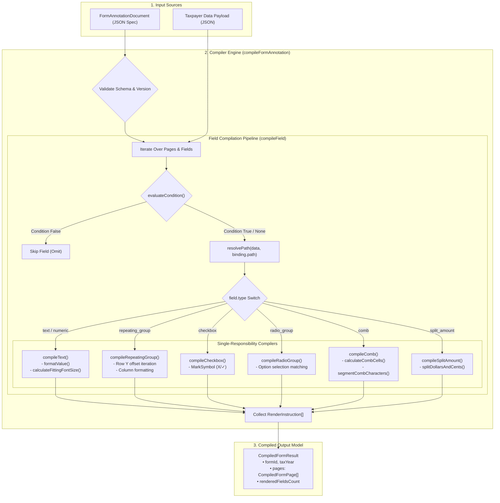

# U.S. Tax Form Field Annotation Specification & React/TypeScript Guide

**Version**: `1.0.0`
**Standard**: Draft-07 / 2020-12 Compatible JSON Schema & TypeScript
**Target Environment**: Web (React / TypeScript), Server (Node.js / Headless Chrome), and Native PDF Engines

> 📊 **Walkthrough Flow**: Jump directly to [Section 5: Step-by-Step Data Processing Pipeline](#5-step-by-step-data-processing-pipeline) or [Section 9: Key Architectural Decisions](#9-key-architectural-decisions--trade-off-rationale).

---

## 1. Executive Summary & Product Concept

### The Problem

In tax preparation software (like TurboTax, H&R Block, or custom fintech backends), when a user completes their tax return, the software needs to **print the calculated values onto official IRS forms** (e.g., Form 1040, W-2, 1099).

However:

1. Every tax form has pre-printed boxes, character combs (e.g. 9 separate boxes for SSN), checkboxes for filing status, and split dollar/cents boxes.
2. If developers hardcode coordinates (`x: 460, y: 104`) into backend business logic, maintaining dozens of forms and annual IRS layout revisions becomes fragile and unmaintainable.

### The Solution

A unified, vendor-neutral **Annotation Specification & Rendering Engine**:

- **Form Annotator (JSON Specification)**: Declares _WHERE_ each box is on the form page, _WHAT_ visual type it is (comb, checkbox, split amount, text), formatting rules, and _WHICH_ JSONPath to read.
- **Data Resolver & Formatters**: Evaluates deep JSONPath expressions (`$.primaryTaxpayer.ssn`, `$.income.w2s[0].wages`), masks SSN/EIN, formats currency, and auto-scales fonts to prevent overflow.
- **Print/Overlay Renderer**: Stamps values on top of the form with pixel-perfect precision in React, HTML (`@media print`), SVG, or PDF streams.

---

## 2. Inputs, Outputs, and Expectations

```
┌──────────────────────────────────────────────────────────┐
│ INPUT 1: Form Annotation Spec (JSON)                     │
│ Describes form geometry, box bounds, comb pitch, & paths │
└────────────────────────────┬─────────────────────────────┘
                             │
                             ├──────────────────────────────► ┌──────────────────────────────────────────────┐
                             │                                │ COMPILER ENGINE                              │
┌────────────────────────────┴─────────────────────────────┐  │ 1. Evaluates conditional rules               │
│ INPUT 2: Taxpayer Return Data (JSON)                     │  │ 2. Extracts deep JSONPath values             │
│ Nested tax return data (names, SSNs, W-2s, refunds)      │  │ 3. Formats currency, dates, combs, & masks  │
└──────────────────────────────────────────────────────────┘  │ 4. Auto-scales fonts to prevent overflow     │
                                                              └──────────────────────┬───────────────────────┘
                                                                                     │
                                                                                     ▼
                                                              ┌──────────────────────────────────────────────┐
                                                              │ OUTPUT: Render Instructions & Overlays       │
                                                              │ • Interactive React Component                │
                                                              │ • Printable HTML/CSS (@media print)          │
                                                              │ • Vector SVG Stream                          │
                                                              │ • Direct PDF Stamp                           │
                                                              └──────────────────────────────────────────────┘
```

### Input 1: Form Annotation Specification (`examples/form-1040-2025.annotation.json`)

Defines the physical layout and data bindings for the IRS form:

- **Page Dimensions**: e.g., $612 \times 792\text{ pt}$ (standard US Letter at $72\text{ DPI}$).
- **Boxes Geometry**: `[x, y, width, height]` for each line.
- **Field Types**:
  - `comb`: Segmented individual character boxes (SSN 9 cells, Routing numbers).
  - `checkbox`: Boolean choices (`X`, `✓`, `■`).
  - `radio_group`: Single-select options (Filing status).
  - `split_amount`: Separate Dollar and Cents boxes on IRS income lines.
  - `text` / `numeric`: Standard lines with alignment and auto-font-scaling.
- **Data Binding**: The JSONPath to read (`binding.path: "$.primaryTaxpayer.ssn"`).

### Input 2: Taxpayer Return Data (`examples/taxpayer-data.sample.json`)

Arbitrary nested data structure from your tax calculation engine:

```json
{
  "taxYear": 2025,
  "filingStatus": "MARRIED_FILING_JOINTLY",
  "primaryTaxpayer": {
    "firstName": "ALEXANDER",
    "middleInitial": "J",
    "lastName": "HAMILTON",
    "ssn": "123456789"
  },
  "income": {
    "totalW2Wages": 249951.0,
    "totalIncome": 276321.5
  }
}
```

### Output: Rendered Form Overlay

- **Interactive React / Browser Overlay**: A responsive UI where values align with pre-printed form boxes.
- **Printable HTML / PDF Output**: When the user presses `Cmd + P` or exports to PDF, values print inside the boxes.

---

## 3. Coordinate System & Geometry Specification

### 3.1 Units and Resolution

- **Standard Unit**: **PDF Points** ($1/72$ inch).
  - $1\text{ inch} = 72\text{ points}$.
  - Standard US Letter page = $8.5 \times 11\text{ inches} = 612 \times 792\text{ points}$.
  - Standard US Legal page = $8.5 \times 14\text{ inches} = 612 \times 1008\text{ points}$.
  - Standard A4 page = $595.28 \times 841.89\text{ points}$.
- **Resolution**: $72\text{ DPI}$ baseline. For high-resolution print ($300\text{ DPI}$ or $600\text{ DPI}$), scale coordinates by $300/72 \approx 4.1667$ or $600/72 \approx 8.3333$.

### 3.2 Coordinate Origin & Translation

The canonical origin for this specification is **Top-Left $(0, 0)$**, matching Browser DOM, React, and SVG viewport systems.

```
(0,0) Top-Left ────────────────────────► +X (Width: 612pt)
 │
 │      ┌───────────────────────┐
 │      │  x, y                 │
 │      │  ┌─────────────────┐  │
 │      │  │ Bounding Box    │  │
 │      │  │ (width, height) │  │
 │      │  └─────────────────┘  │
 ▼      └───────────────────────┘
+Y (Height: 792pt)
```

#### Native PDF Bottom-Left Coordinate Translation Formula

When stamping text directly onto PDF canvas streams (where origin is **Bottom-Left $(0,0)$**):

$$X_{\text{pdf}} = X_{\text{spec}}$$

$$Y_{\text{pdf}} = \text{PageHeight} - (Y_{\text{spec}} + \text{Height}_{\text{box}})$$

---

## 4. Field Types Catalog

| Field Type        | Typical Tax Form Use Case                                              | Key Attributes                                                       |
| :---------------- | :--------------------------------------------------------------------- | :------------------------------------------------------------------- |
| `text`            | Taxpayer Name, Address, Occupation, Employer Name                      | `bounds`, `styling.textAlign`, `formatting`                          |
| `numeric`         | Total Income, Deductions, Standard Numeric Lines                       | `bounds`, `formatting.decimalPlaces`, `formatting.negativeStyle`     |
| `comb`            | SSN (9 cells), EIN (9 cells), Routing Number (9 cells), Account Number | `combConfig.cellCount`, `combConfig.pitch`, `combConfig.segmentGaps` |
| `checkbox`        | Digital Assets (Yes/No), Third Party Designee, Standard Deduction      | `bounds`, `markSymbol` (`"X"`, `"✓"`, `"■"`), `condition`            |
| `radio_group`     | Filing Status (Single, MFJ, MFS, HOH, QSS), Account Type               | `radioOptions[]` with distinct `value` and `bounds`                  |
| `split_amount`    | IRS Form 1040 Income Lines (Dedicated Dollars box and Cents box)       | `splitAmountConfig.dollarsBounds`, `splitAmountConfig.centsBounds`   |
| `repeating_group` | Schedule B Interest/Dividends, W-2 State Tax rows                      | `repeatingGroupConfig.maxRows`, `rowStride`, `columns[]`             |

### 4.1 IRS Form 1040 Reference Field Mapping

The engine separates presentation into a **Transparent Data Overlay Layer** that sits on top of an official IRS form template:

#### Page 1: Identity, Status & Income Lines

- **Filing Status**: Radio Group (Single, Married Filing Jointly, Married Filing Separately, Head of Household, Qualifying Surviving Spouse)
- **Primary Taxpayer**: First Name, Middle Initial, Last Name, and 9-cell Comb SSN (`1 2 3 4 5 6 7 8 9`)
- **Spouse Taxpayer**: Conditional First Name, Last Name, and 9-cell Comb SSN (`9 8 7 6 5 4 3 2 1`)
- **Home Address**: Street, Apt No, City, State, and Zip Code
- **Digital Assets**: Checkboxes for Yes / No
- **Line 1a (W-2 Wages)**: Split Amount (`249,951` | `00`)
- **Line 2b (Taxable Interest)**: Split Amount (`3,420` | `50`)
- **Line 3b (Ordinary Dividends)**: Split Amount (`8,750` | `00`)
- **Line 1z (Total Income)**: Split Amount (`276,321` | `50`)

#### Page 2: Taxes, Payments, Refund & Signatures

- **Line 25d (Federal Income Tax Withheld)**: Split Amount (`49,600` | `00`)
- **Line 33 (Total Payments)**: Split Amount (`49,600` | `00`)
- **Line 34 (Overpaid Amount)**: Split Amount (`4,520` | `80`)
- **Line 35a (Amount Refunded to You)**: Split Amount (`4,520` | `80`)
- **Line 35b (Routing Number)**: 9-cell Comb (`0 2 1 0 0 0 0 2 1`)
- **Line 35c (Account Type)**: Radio Selection (`X` for Checking or Savings)
- **Line 35d (Account Number)**: 17-cell Comb (`9 8 7 6 5 4 3 2 1 0 1 2 3`)
- **Sign Here (Primary Occupation)**: Text (`TREASURY SECRETARY`)
- **Sign Here (Spouse Occupation)**: Text (`PHILANTHROPIST`)

---

## 5. Step-by-Step Data Processing Pipeline



---

## 6. Complete Project Folder & File Structure

```
InsteadTest/
├── index.html                               # Minimal React Studio HTML Mounting Entry Point
├── package.json                             # Dependencies, scripts (npm test, npm run dev)
├── README.md                                # Project overview and quickstart
├── SPECIFICATION.md                         # Complete unified specification & architecture manual (This file)
│
├── schema/
│   └── tax-form-annotation.schema.json      # Draft-07 / 2020-12 validatable JSON Schema
│
├── examples/
│   ├── form-1040-2025.annotation.json       # Real IRS Form 1040 annotation (combs, radios, split amounts)
│   └── taxpayer-data.sample.json            # Deeply nested sample tax return data
│
├── src/
│   ├── main.ts                              # React DOM root mounting entry point
│   ├── App.ts                               # Main Studio Orchestrator component
│   ├── index.ts                             # Public library API export
│   │
│   ├── styles/
│   │   └── studio.css                       # Studio Light/Dark theme and print media stylesheet
│   │
│   ├── constants/                           # (SRP) Hardcoded constants isolated from logic
│   │   ├── page-constants.ts                # Letter, Legal, A4 dimensions (72 DPI points)
│   │   ├── field-constants.ts               # Field types, mark symbols (X, ✓), alignments
│   │   ├── font-constants.ts                # Standard fonts, font sizes, minFontSize
│   │   ├── formatter-constants.ts           # Formatter enum names, masks, date formats
│   │   └── index.ts                         # Constants barrel export
│   │
│   ├── types/                               # Strongly typed TypeScript interfaces
│   │   ├── schema.ts                        # FormAnnotationDocument, FieldAnnotation, BoundingBox, CombConfig
│   │   ├── rendering.ts                     # RenderInstruction, CombCell, CompiledFormResult
│   │   ├── tax-data.ts                      # Taxpayer return payload interfaces
│   │   └── index.ts                         # Types barrel export
│   │
│   │
│   ├── engine/                              # Pure Functional Processing Modules
│   │   ├── resolver.ts                      # JSONPath & Condition Evaluator
│   │   ├── layout.ts                        # Comb layout & font scaling
│   │   ├── tests/                           # Engine-level unit tests (PathResolver, ConditionEvaluator, Layout)
│   │   ├── formatters/                      # Dedicated SRP Formatters
│   │   │   ├── tests/                       # Unit tests for each pure formatter
│   │   │   └── ...
│   │   └── compiler/                        # Dedicated SRP Compilers
│   │       ├── tests/                       # Unit tests for each pure compiler
│   │       └── ...
│   │
│   ├── components/                          # Modular React Components (TSX)
│   │   ├── tests/                           # Component contract and prop interface tests
│   │   ├── studio/                          # Studio layout components
│   │   │   └── tests/                       # Studio workbench component tests
│   │   └── ...
│   ├── App.tsx                              # Studio Root App Component
│   ├── main.tsx                             # Entry point mounting to #root
│   └── index.ts                             # Public Library API Export
```

---

## 7. React Component Integration Guide

```tsx
import React, { useState } from "react";
import { ReactTaxFormOverlay } from "./src/components/ReactTaxFormOverlay.tsx";
import type { FormAnnotationDocument } from "./src/types/schema.ts";

// Import form annotation and taxpayer dataset
import form1040Annotation from "./examples/form-1040-2025.annotation.json";
import taxpayerData from "./examples/taxpayer-data.sample.json";

export function TaxReturnPreviewPage() {
  const [showGuides, setShowGuides] = useState(true);

  return (
    <div className="tax-preview-container">
      <div className="controls">
        <label>
          <input
            type="checkbox"
            checked={showGuides}
            onChange={(e) => setShowGuides(e.target.checked)}
          />
          Show Annotation Bounding Boxes
        </label>
        <button onClick={() => window.print()}>Print Form</button>
      </div>

      <ReactTaxFormOverlay
        document={form1040Annotation as FormAnnotationDocument}
        data={taxpayerData}
        initialShowDebug={showGuides}
        scale={1.0}
        onFieldClick={(fieldId) => console.log("Clicked box:", fieldId)}
      />
    </div>
  );
}
```

---

## 8. Running & Verification Commands

| Command                  | Action                                                              |
| :----------------------- | :------------------------------------------------------------------ |
| **`npm test`**           | Runs all 52 unit and component DOM tests with Vitest & RTL          |
| **`npm run test:watch`** | Starts Vitest in interactive watch mode                             |
| **`npm run typecheck`**  | Validates TypeScript syntax and types using official `tsc --noEmit` |
| **`npm run format`**     | Verifies code formatting with Prettier                              |
| **`npm run format:fix`** | Automatically formats all files with Prettier                       |
| **`npm run validate`**   | Runs full CI validation pipeline (`typecheck` + `test`)             |
| **`npm run dev`**        | Starts the interactive Tax Form Studio at `http://localhost:3000`   |
| **`npm run build`**      | Builds production bundle with Vite                                  |

---

## 9. Key Architectural Decisions & Trade-off Rationale

### 1. Pure Functional Architecture (No Classes / No OOP Ceremony)

- **Decision**: Replaced all classes, `static` methods, and `new` instantiations with pure, stateless, single-responsibility functions (`compileText`, `compileCheckbox`, `resolvePath`, `formatCurrency`).
- **Rationale**: Pure functions provide deterministic output for identical inputs, have zero side effects, eliminate memory leaks from retained instance state, and enable tree-shaking for minimal bundle footprints.

### 2. Standard Top-Left Coordinate System with Native PDF Bottom-Left Translation

- **Decision**: Used standard Top-Left $(0,0)$ in points ($1/72$ inch) as the primary specification origin, paired with a deterministic mathematical transformation function `toPdfCoordinates(bounds, pageHeight)`.
- **Rationale**: Web browsers, React DOM, SVG viewports, and CSS bounding boxes all operate with Top-Left origins. Storing Top-Left in the JSON schema eliminates cognitive overhead during web design and layout debugging, while preserving mathematical compatibility with bottom-left PDF canvas streams ($Y_{\text{pdf}} = \text{Height}_{\text{page}} - (Y_{\text{spec}} + \text{Height}_{\text{box}})$).

### 3. Transparent Data Overlay Layer vs. Bundled Static Form PDFs

- **Decision**: Built the engine as a decoupled transparent overlay layer that accepts external pre-printed IRS form background templates via `backgroundImageUrl` or CSS background layers.
- **Rationale**: Bundling multi-megabyte scanned IRS PDFs directly into web assets inflates bundle sizes and slows down rendering. Decoupling the data layer makes the calculation engine fast, lightweight, and capable of overlaying onto SVG, PNG, HTML canvas, or direct PDF streams.

### 4. Single Unified Element Renderer (`TaxFormFieldElement`)

- **Decision**: Rendered all instruction types (`text`, `comb_cells`, `mark`, `split_amount`) through a single unified component utilizing pure geometric helpers (`toBoxStyle()`, `getClassName()`).
- **Rationale**: Avoids code duplication across distinct component wrappers, standardizes font auto-scaling and selection borders, and simplifies debug box rendering.

### 5. Centralized UI Constants & Zero Hardcoded Strings

- **Decision**: Isolated all UI labels, button text, tooltips, tab identifiers, and icons in [`src/constants/ui-constants.ts`](file:///Users/atulkumarawasthi/projects/InsteadTest/src/constants/ui-constants.ts).
- **Rationale**: Eliminates magic strings, ensures consistency between UI components and unit tests, and prepares the application for internationalization (i18n) and accessibility labeling.

### 6. Modern Colocated Vitest + React Testing Library Stack

- **Decision**: Migrated to Vitest with `@testing-library/react` and `jsdom`, colocating tests inside `src/**/tests/`.
- **Rationale**: Provides native `.tsx` compilation, simulates real browser DOM user interactions (clicking buttons, toggling checkboxes), and features automatic teardown (`cleanup()` and `vi.clearAllMocks()`) in `setupTests.ts` to prevent test pollution and memory leaks.

---

## 10. Potential Future Enhancements & Roadmap

### 1. Direct PDF Vector Generation & Form Flattening via WebAssembly

- **Vision**: Integrate WebAssembly-based PDF writers (e.g. `pdf-lib` or Rust/WASM PDF tools) directly in the browser or Node.js server.
- **Benefit**: Enables client-side vector PDF generation that stamps text and marks directly into official IRS PDF byte streams without requiring a server backend.

### 2. Visual Drag-and-Drop Studio Annotation Editor

- **Vision**: Add interactive bounding-box drawing, snapping grids, and visual drag-and-drop resizing onto scanned IRS PDF pages in the Studio UI.
- **Benefit**: Allows tax analysts and non-engineers to visually define and adjust field bounding boxes and generate valid annotation JSON specs without writing code.

### 3. Bi-Directional Interactive Form Editing

- **Vision**: Turn the overlay from a read-only viewer into an interactive form where users can click into any box, type new values, and have changes automatically update the underlying taxpayer JSON payload.
- **Benefit**: Provides an intuitive "fill-in-the-blank" tax return experience directly on top of the IRS form layout.

### 4. Multi-Form Cascading & State Schedules

- **Vision**: Support multi-form dependency graphs where federal Form 1040 fields automatically cascade and populate linked state schedules (e.g., NY IT-201, CA 540) and supporting schedules (Schedule 1, Schedule A/B/C).
- **Benefit**: Eliminates redundant data entry and creates an end-to-end tax filing document bundle.

### 5. Full WCAG 2.1 AA Accessibility & Screen Reader Support

- **Vision**: Add ARIA live regions, semantic field annotations, and navigable reading orders across multi-column tax lines and comb character boxes.
- **Benefit**: Guarantees government and enterprise compliance for users with visual and motor impairments.

### 6. Annual Tax Year Schema Versioning & Auto-Migration Tooling

- **Vision**: Provide CLI migration utilities to automatically upgrade annotation specs across tax years (e.g., 2024 $\to$ 2025 $\to$ 2026), accounting for IRS line renumbering and inflation-adjusted standard deduction shifts.
- **Benefit**: Simplifies annual tax season maintenance.
